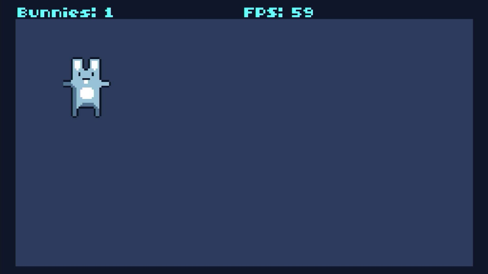

# pi-tic80

**The TIC-80 fantasy console running directly on a Raspberry Pi with no
operating system.** The board powers on and the console is what boots: no
Linux, no desktop, no launcher, and nothing else running beside it.

It builds for the Raspberry Pi 3, Pi 4 and Pi 5, all three from one source
tree.



*Captured from the Pi 5's HDMI output — the bunnymark cartridge, holding 59
frames a second.*

## What this is

[TIC-80](https://github.com/nesbox/TIC-80) is a fantasy computer: a small
machine that never existed, with a 240x136 screen, sixteen colours, four
sound channels, and its own code, sprite, map, sound and music editors built
in. Programs for it are single files called cartridges. This repository is the
thin layer that lets it run with nothing underneath: a
[Circle](https://github.com/rsta2/circle) kernel that brings the board up, and
[circle-libsdl2](https://github.com/Xalior/circle-libsdl2), an SDL2
implementation built on Circle's bare-metal drivers.

TIC-80's own source is not copied or modified here. It is a submodule, pinned
at an upstream commit, and the build reads it without ever writing to it.
Where the console needs something that is not SDL2 and that a bare-metal C
library does not provide, this repository supplies it in `host/`.

The console draws at 256x144 — its 240x136 screen and the border around it —
and the picture is scaled once onto whatever your screen actually is.

## What works

The console runs, and so do its editors.

- **Picture and sound.** The console's screen and its four sound channels.
- **Keyboard and mouse.** Both, which the built-in editors need.
- **Game controllers.** TIC-80's four-player pad mapping.
- **Cartridges.** Loaded from and saved to the SD card. The demonstration
  cartridges are built in — type `demo` at the console and they are written
  out as real files you can load, run and edit.

What is missing:

- **Every language except Lua.** TIC-80 supports a dozen — Ruby, JavaScript,
  Fennel, Wren, Python and more — and this build carries only Lua, the one
  TIC-80 treats as its default.
- **Networking.** The cartridge browser lists what is on the card and nothing
  else; it cannot reach the community site.
- **The spectrum functions.** `fft()` and `ffts()` listen to an audio input,
  and there is none, so they report silence.
- **The PRO features.** Text-format cartridges and some export formats are a
  paid upstream build. Cartridges here must be the binary `.tic` or `.png`
  kind.

## What you need to supply

Nothing, to start. TIC-80 carries its own demonstration cartridges inside the
binary, and `demo` at its console writes them onto the card as real files you
can then load, run and edit.

Cartridges are the console's data, and they are other people's work. This
repository ships none.

```sh
make media
```

fetches two cartridges from TIC-80's own repository, at the commit this
repository pins for the submodule, under the MIT licence that repository
carries:

| File | What it is |
|---|---|
| `bunny.tic` | The bunnymark demonstration — bouncing sprites, running by itself, needing no input. |
| `cart-template.tic` | The empty starter cartridge, with the default palette and font and no program. |

Both are checked against a recorded SHA256 and an exact byte count. TIC-80
publishes no checksum for either file, so the recorded checksum is the only
comparison available; it was computed from the copy this project fetched.
There is no format check because a `.tic` cartridge has no magic number — the
format is a bare stream of chunks.

`make media` writes a `provenance.txt` beside what it downloads, naming the
source, the date and the licence.

Anything else — cartridges from tic80.com, from itch.io, from a friend — is
yours to obtain and to put on the card. Community cartridges carry no blanket
licence, and this project does not collect them.

## Building

You need a Linux or macOS machine, GNU make, and the Arm GNU toolchain for
`aarch64-none-elf` (release 15.2.Rel1). Put its `bin` directory on your
`PATH`, or unpack it into `toolchains/` in this repository.

```sh
git clone --recursive https://github.com/Xalior/pi-tic80.git
cd pi-tic80
make deps       # long: builds newlib and libc++ from source, once per board
make kernels    # the three board images
make verify     # confirms each image exists and is not empty
```

`make deps` is the slow step, and it is slow once. It builds a complete C and
C++ world for each board, because each board's world is compiled for its own
processor.

Part of that world is libc++, whose sources are fetched from a git tag that
carries the bare-metal patches. That tag is hosted on Codeberg, which is small
and volunteer run. One copy is enough for every board and for every project on
your machine, so tell the build where to keep it and it is fetched once:

```sh
make deps CIRCLE_LLVM=/path/to/circle-llvm
```

The default puts that checkout beside this repository, which is the right
answer for a plain clone or a continuous-integration runner and needs no
setting at all.

The images land in `host/build/<board>/`:

| Board | Image |
|---|---|
| Pi 3 | `host/build/rpi3/kernel8.img` |
| Pi 4 | `host/build/rpi4/kernel8-rpi4.img` |
| Pi 5 | `host/build/rpi5/kernel_2712.img` |

Building one board on its own is `make rpi5`, and its dependencies alone are
`make deps-rpi5`, which is what a machine without room for three worlds wants.

On macOS, use GNU make 4 (`gmake`, from Homebrew) rather than the make macOS
ships. The system one is version 3.81, and there are situations in which it
stops with no output at all and names no reason.

## Putting it on a card

```sh
make card
```

That stages the card into `build/sd-card/` for you to copy onto FAT32 media:
the three kernel images under the names each board's firmware looks for, the
boot configuration, and whatever cartridges `make media` left, in
`games/tic80/`. It downloads nothing itself, and it says which files are
absent.

One thing is not staged and has to be added by hand: **the Raspberry Pi
firmware files** — `bootcode.bin`, `start*.elf`, `fixup*.dat` and, for the
Pi 4, `armstub8-rpi4.bin`. Take them from a Raspberry Pi OS card or from the
[firmware repository](https://github.com/raspberrypi/firmware).

Everything this console reads and writes stays inside `games/tic80/` on the
card. A card can carry several of these projects, and each keeps to its own
directory rather than writing settings into the card's root.

### Keeping it cool

The card carries `cmdline.txt`, which sets the temperature the board is
allowed to reach and the pin its fan is on:

    socmaxtemp=70 gpiofanpin=45

Pin 45 is the Raspberry Pi 5 Case Fan and Active Cooler. With a fan named,
reaching 70°C switches the fan on and the processor keeps running at full
speed. Without one it would be slowed down instead, and a slowed processor
drops frames.

If your fan is wired somewhere else, change the pin number.

## License

The code in this repository — the kernel layer in `host/` and the build — is
released under the GNU Lesser General Public License, version 3. See
[LICENSE](LICENSE).

The submodules are other people's work and carry their own terms, and both
matter before you distribute anything you build here:

- **TIC-80** is released under the MIT licence. The libraries vendored inside
  it — Lua, zlib, libpng, giflib and others — carry their own, listed in that
  repository's `THIRD_PARTY_LICENSES.md`.
- **Circle** is released under the GNU General Public License, version 3.

Building a kernel image here combines all of them, and the result is covered
by the GNU General Public License, version 3. Doing that for yourself is
straightforward; redistributing the result means satisfying every one of those
terms at once, including supplying complete source.
